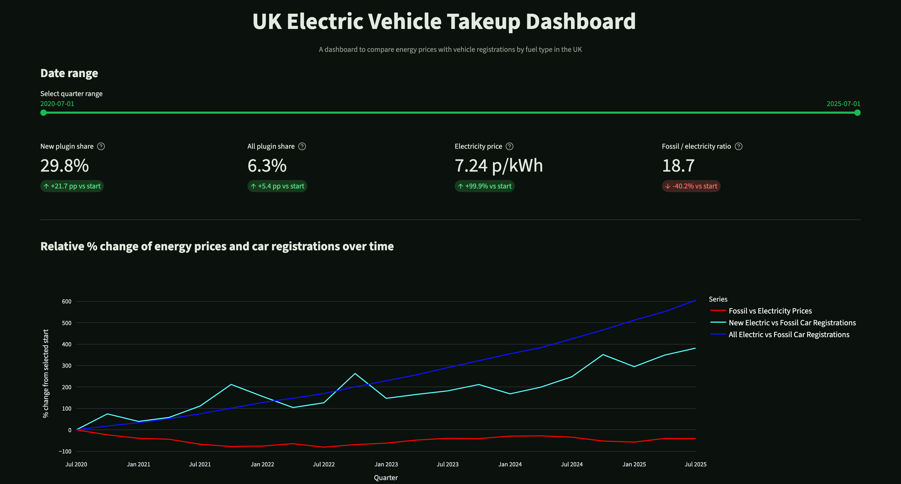
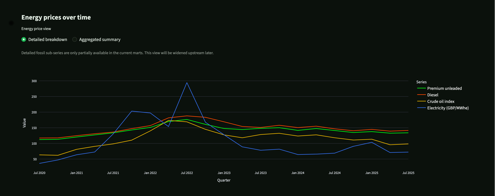
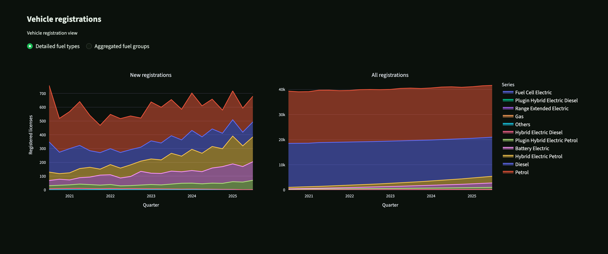
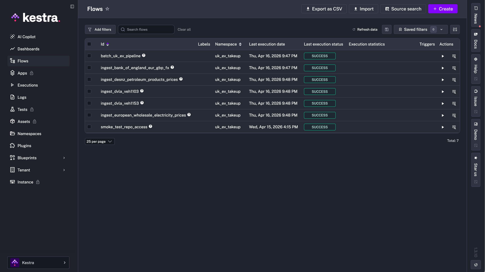
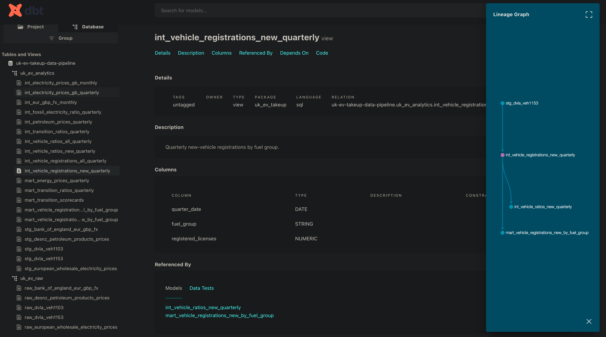
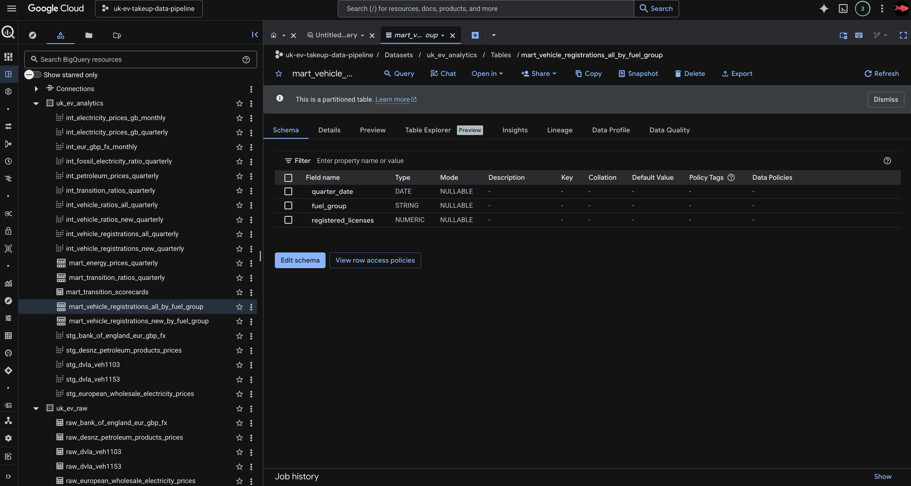

# UK EV Takeup Data Pipeline

A batch data engineering pipeline and dashboard for analysing the relationship between UK vehicle fuel-type transition and energy price trends. The project ingests public transport and energy datasets, stores raw and prepared data in Google Cloud, transforms it in BigQuery with dbt, orchestrates the full workflow with Kestra, and serves the final analytical views in Streamlit.


---

## Overview

This project explores a simple but important question:

**Are electric vehicles gaining share quickly enough to offset the worsening relative cost of electricity versus traditional fossil fuels?**

To answer that, the pipeline combines:

- UK vehicle registration data from the DVLA

- UK petroleum price data from DESNZ

- European wholesale electricity price data

- Bank of England FX data for EUR/GBP normalization

The final dashboard shows:

- how vehicle fuel-type share has changed over time

- how electricity and fossil fuel prices have changed over time

- how their relative ratios have changed from a selected baseline date

[Back to top](#uk-ev-takeup-data-pipeline)

---

## Table of Contents

- [Problem Statement](#problem-statement)

- [Objective](#objective)

- [Tech Stack](#tech-stack)

- [Architecture Diagram](#architecture-diagram)

- [Dataset](#dataset)

  - [Source Summary](#source-summary)

  - [Raw Tables](#raw-tables)

- [BigQuery Data Model](#bigquery-data-model)

  - [Key Intermediate Tables](#key-intermediate-tables)

  - [Final Marts](#final-marts)

  - [Partitioning and Clustering](#partitioning-and-clustering)

- [Pipeline Workflow](#pipeline-workflow)

- [Screenshots](#screenshots)

- [Key Findings](#key-findings)

- [Future Improvements](#future-improvements)

- [Reproducibility](#reproducibility)

  - [Prerequisites](#prerequisites)

  - [Quickstart](#quickstart)

[Back to top](#uk-ev-takeup-data-pipeline)

---

## Problem Statement

The UK vehicle fleet is transitioning away from fossil fuels, but the economics of that transition are not always moving in the same direction. While plugin and battery-electric vehicles are increasing in share, the relative price of electricity versus traditional fuels has also shifted over time. This makes it difficult to judge whether the transition is progressing under improving or worsening cost conditions.

[Back to top](#uk-ev-takeup-data-pipeline)

---

## Objective

The objective of this project is to build a reproducible batch pipeline that:

- ingests multiple public datasets with different formats and update cadences

- standardises and joins them into a usable analytical model

- stores data in a warehouse designed for dashboard access

- exposes the final outputs through a simple interactive dashboard

- supports both local execution and an eventual cloud VM execution mode

[Back to top](#uk-ev-takeup-data-pipeline)

---

## Tech Stack

This project is designed around a **two-mode architecture**:

- **Local mode**: compute runs on the assessor’s machine via Docker Compose, while cloud storage and warehousing live in GCP

- **Cloud mode**: planned next phase, where Terraform provisions a VM and the full stack runs remotely there

### Stack summary

| Layer | Tool | Purpose |
|---|---|---|
| Infrastructure | Terraform | Provisions local-mode cloud resources in GCP |
| Storage | Google Cloud Storage | Stores raw and prepared source files |
| Warehouse | BigQuery | Stores raw tables and analytical models |
| Transformation | dbt Core | Builds staging, intermediate, and mart models |
| Orchestration | Kestra | Runs source ingestion flows, final mart builds, and tests |
| Dashboard | Streamlit | Serves interactive analytical charts |
| Runtime | Docker Compose | Starts local services for Kestra, Postgres, and Streamlit |
| Automation | Makefile | Provides one-command project setup and run flow |
| Language | Python | Handles ingestion, wrangling, uploads, and app logic |

### Design notes

In local mode, Terraform provisions the GCP dependencies and Docker Compose runs the local services. Kestra orchestrates the end-to-end batch flow, dbt builds the warehouse layer in BigQuery, and Streamlit queries the final marts directly.

Cloud mode is planned as an extension of the same architecture. The only intended difference is that Terraform will provision a VM and the same operational stack will run there instead of on the assessor’s local machine.

[Back to top](#uk-ev-takeup-data-pipeline)

---

## Architecture Diagram

Recommended diagram flow:

**Source websites → Python ingestion scripts → GCS raw/prepared zones → BigQuery raw tables → dbt staging/intermediate/marts → Kestra orchestration → Streamlit dashboard**

Suggested image path:
docs/images/architecture_diagram.png


[Back to top](#uk-ev-takeup-data-pipeline)

---

## Dataset

### Source Summary

| Source | Provider | Format | Update Frequency | Coverage | Why it is used |
|---|---|---|---|---|---|
| EUR/GBP exchange rate | Bank of England | HTML table | Daily / periodic | Historical | Converts European electricity pricing into GBP terms |
| European wholesale electricity prices | Ember / European source | CSV | Monthly | Since 2015 | Provides electricity price series for comparison with transport fuel prices |
| Petroleum products prices (4.1.1) | DESNZ | Excel | Monthly | Since 1989 | Provides UK petrol/diesel pricing and crude oil index series |
| VEH1103 | DVLA | ODS | Monthly / quarterly source table | Since 2001 | Provides total licensed vehicles by fuel type |
| VEH1153 | DVLA | ODS | Monthly / quarterly source table | Since 2001 | Provides new vehicle registrations by fuel type |

[Back to top](#uk-ev-takeup-data-pipeline)

---

### Raw Tables

The pipeline stores each source in BigQuery raw tables after initial file preparation.

---

#### `raw_bank_of_england_eur_gbp_fx`

| Attribute | Value |
|---|---|
| Source | Bank of England |
| URL | Supplied via `.env` |
| File Type | HTML extracted to CSV |
| Grain | Daily FX observations |
| Important Columns | `date`, `gbp_eur_rate` |
| Description | EUR/GBP conversion series used to convert European electricity prices into GBP |

---

#### `raw_european_wholesale_electricity_prices`

| Attribute | Value |
|---|---|
| Source | European wholesale electricity dataset |
| URL | Supplied via `.env` |
| File Type | CSV |
| Grain | Monthly |
| Important Columns | `date`, `country`, `price_eur_mwh` |
| Description | Monthly wholesale electricity pricing used to derive UK-relevant electricity cost trends |

---

#### `raw_desnz_petroleum_products_prices`

| Attribute | Value |
|---|---|
| Source | DESNZ table 4.1.1 |
| URL | Supplied via `.env` |
| File Type | XLSX |
| Grain | Quarterly after preparation |
| Important Columns | `year`, `quarter`, `premium_unleaded`, `diesel`, `crude_oil_index` |
| Description | UK petroleum and crude oil series used to compare fossil fuel pricing with electricity |

---

#### `raw_dvla_veh1103`

| Attribute | Value |
|---|---|
| Source | DVLA VEH1103 |
| URL | Supplied via `.env` |
| File Type | ODS |
| Grain | Quarterly after preparation |
| Important Columns | `geography`, `date_label`, `body_type`, detailed fuel-type columns |
| Description | Total licensed vehicles by fuel type, used to measure the fuel composition of the entire fleet |

---

#### `raw_dvla_veh1153`

| Attribute | Value |
|---|---|
| Source | DVLA VEH1153 |
| URL | Supplied via `.env` |
| File Type | ODS |
| Grain | Quarterly after preparation |
| Important Columns | `geography`, `date_label`, `body_type`, `keepership`, detailed fuel-type columns |
| Description | New vehicle registrations by fuel type, used to measure current transition in new purchases |

[Back to top](#uk-ev-takeup-data-pipeline)

---

## BigQuery Data Model

### Key Intermediate Tables

| Table | Grain | Purpose |
|---|---|---|
| `int_eur_gbp_fx_monthly` | Month | Aligns FX data to monthly grain |
| `int_electricity_prices_gb_monthly` | Month | Converts electricity prices into GBP |
| `int_electricity_prices_gb_quarterly` | Quarter | Aggregates electricity prices to dashboard grain |
| `int_petroleum_prices_quarterly` | Quarter | Cleans and standardises fossil fuel price series |
| `int_vehicle_registrations_new_quarterly` | Quarter x fuel group | Aggregates new registrations into dashboard fuel groups |
| `int_vehicle_registrations_all_quarterly` | Quarter x fuel group | Aggregates all registrations into dashboard fuel groups |
| `int_vehicle_ratios_new_quarterly` | Quarter | Calculates plugin vs fossil ratio for new registrations |
| `int_vehicle_ratios_all_quarterly` | Quarter | Calculates plugin vs fossil ratio for all registrations |
| `int_fossil_electricity_ratio_quarterly` | Quarter | Combines fossil and electricity prices into comparable ratio series |
| `int_transition_ratios_quarterly` | Quarter | Combines energy and vehicle ratio trends for the dashboard |

[Back to top](#uk-ev-takeup-data-pipeline)

---

### Final Marts

| Mart | Grain | Purpose | Used by Dashboard |
|---|---|---|---|
| `mart_energy_prices_quarterly` | Quarter | Final energy price series including electricity and fossil measures | Yes |
| `mart_vehicle_registrations_new_by_fuel_group` | Quarter x fuel group | Final grouped series for new registrations | Yes |
| `mart_vehicle_registrations_all_by_fuel_group` | Quarter x fuel group | Final grouped series for all registrations | Yes |
| `mart_transition_ratios_quarterly` | Quarter | Final ratio series used for rebased trend chart | Yes |
| `mart_transition_scorecards` | Snapshot | Final headline scorecard metrics | Yes |

[Back to top](#uk-ev-takeup-data-pipeline)

---

### Partitioning and Clustering

To satisfy the warehouse optimization requirement, key final marts are physically optimised in BigQuery.

#### Partitioned marts

These tables are partitioned by `quarter_date`:

- `mart_energy_prices_quarterly`
- `mart_transition_ratios_quarterly`
- `mart_vehicle_registrations_new_by_fuel_group`
- `mart_vehicle_registrations_all_by_fuel_group`

#### Clustered marts

These vehicle marts are additionally clustered by `fuel_group`:

- `mart_vehicle_registrations_new_by_fuel_group`
- `mart_vehicle_registrations_all_by_fuel_group`

This improves scan efficiency for dashboard queries that commonly:
- filter on date windows
- group or filter by fuel group

[Back to top](#uk-ev-takeup-data-pipeline)

---

## Pipeline Workflow

### 1. Source retrieval challenges

The five sources are heterogeneous and awkward in different ways:

- some are directly downloadable files
- some are web pages containing tables
- some are Excel or ODS files with high-offset headers
- some use inconsistent date labels and mixed data types
- some require manual column name cleaning before BigQuery can ingest them

The ingestion layer standardises these source-specific issues before data enters the warehouse.

### 2. Raw ingestion and storage

Each source is downloaded locally by a Python ingestion script, then:

- raw files are uploaded to GCS under a `raw/` prefix
- cleaned/prepared files are written locally as parquet where needed
- prepared files are uploaded to GCS under a `prepared/` prefix
- BigQuery raw-load scripts ingest those prepared files into raw warehouse tables

### 3. Cleaning and type normalization

The raw data required substantial wrangling, including:

- cleaning invalid BigQuery column names
- casting mixed-type date and string fields
- reconstructing quarter dates from inconsistent labels
- normalising fuel-type columns
- converting wide source tables into reusable analytical forms

### 4. Joining and aggregation

dbt is used to transform raw warehouse tables into analytical layers:

- staging models rename and standardise fields
- intermediate models align grain and combine energy + vehicle data
- mart models expose dashboard-ready tables

The current dashboard grain is quarterly.

### 5. BigQuery optimisation

Final dashboard-facing marts are materialized as physical BigQuery tables. Relevant tables are partitioned by `quarter_date`, and vehicle marts are clustered by `fuel_group`.

### 6. Dashboard query layer

The dashboard queries final marts directly for the main charts and scorecards. Some temporary prototype drill-down views also query staging models directly to test detailed fuel-type charting before those structures are promoted upstream into dbt.

### 7. Infrastructure and orchestration design

The project uses:

- **Terraform** to provision GCP infrastructure for local mode
- **Docker Compose** to run the local service stack
- **Kestra** to orchestrate:
  - five source ingestion subflows
  - final mart rebuild
  - final dbt mart tests
- **Makefile** to wrap setup and operation into a minimal command surface

The main operational entrypoint is:

```bash
make run-local
```

which:

* applies Terraform
* starts Docker Compose
* waits for Kestra
* triggers the full batch pipeline

[Back to top](#uk-ev-takeup-data-pipeline)

## Screenshots

### Dashboard






### Kestra batch flow



### dbt lineage graph



### BigQuery marts



[Back to top](#uk-ev-takeup-data-pipeline)

---

## Key Findings

Broadly speaking, the dashboard suggests that:

- plugin and electric vehicles are increasing in share over time
- that increase is visible both in new registrations and, more slowly, across the total vehicle stock
- electricity prices have risen strongly over parts of the study period
- the relative cost relationship between electricity and traditional fossil fuels has not always improved in favour of electrification

In short, **electrical cars are increasing in share while the cost of electricity has, at times, risen relatively faster than traditional fossil fuels**.

[Back to top](#uk-ev-takeup-data-pipeline)

---

## Future Improvements

- complete the **cloud mode** by provisioning a VM and running the full stack remotely
- redesign the warehouse to support a **monthly** analytical grain rather than quarterly
- remove hardcoded date bounds from marts to support wider historical windows
- promote prototype detailed-fuel queries from Streamlit into dbt models
- add scheduled monthly batch updates in Kestra
- improve latest-file retrieval logic for each source website
- enrich dashboard controls for detailed vs aggregated series and rebasing options

[Back to top](#uk-ev-takeup-data-pipeline)

---

## Reproducibility

This project is designed to be reproducible in two modes:

- **Local mode**: Terraform provisions the shared GCP resources, while Docker runs Kestra, Postgres, and Streamlit on the assessor’s own machine.
- **Cloud mode**: Terraform provisions the shared GCP resources and a Compute Engine VM, and the application stack runs on that VM.

At the time of writing, the most reliable path is **local mode**. Cloud mode is included as an intended deployment path, but the assessor should treat **local mode as the primary assessed workflow** unless otherwise stated.

[Back to top](#uk-ev-takeup-data-pipeline)

---

### Prerequisites

Before attempting either mode, the assessor should have the following installed locally:

- **Git**
- **VS Code** or another code editor
- **Python 3.13**
- **uv**
- **Docker Desktop** or Docker Engine with Docker Compose support
- **Terraform**
- **Google Cloud SDK (`gcloud`)**
- a **Google Cloud Platform account** with permission to create a project and link billing

#### Required local software

Recommended install checks:

``` bash
git --version
python3 --version
uv --version
docker --version
docker compose version
terraform version
gcloud version
```

#### Clone the repository

Clone the repository locally and enter the project folder:

``` bash
git clone https://github.com/Teqfish/UK_EV_Takeup_Data_Pipeline.git
cd UK_EV_Takeup_Data_Pipeline
```

---

### GCP setup required before running the project

Both **local mode** and **cloud mode** rely on GCP resources. The assessor must therefore create and configure a GCP project first.

#### 1. Create a GCP project

In the Google Cloud Console:

1. Open the **Google Cloud Console**
2. Click the **project selector** at the top
3. Click **New Project**
4. Enter a project name
5. Create the project
6. Switch into the newly created project

#### 2. Link a billing account

A billing account must be linked, otherwise Terraform will fail when trying to provision resources.

In the Google Cloud Console:

1. Open **Billing**
2. Select or create a billing account
3. Link the new project to that billing account

#### 3. IAM permissions for the assessor’s user

The assessor’s own Google account needs permissions on the project so Terraform can create resources.

For the simplest setup, the assessor should ensure their user has:

- **Owner**

If they created the project themselves, this is usually already true.

To check or grant this in the Google Cloud Console:

1. Open **IAM & Admin**
2. Open **IAM**
3. Find the assessor’s Google account
4. Confirm it has the **Owner** role

This is the minimum practical setup for reproducing the project quickly.

#### 4. Enable required APIs

In the Google Cloud Console, enable these APIs for the project:

- **Compute Engine API**
- **Cloud Storage API**
- **BigQuery API**
- **Identity and Access Management (IAM) API**

In the console:

1. Open **APIs & Services**
2. Open **Library**
3. Search each API by name
4. Click **Enable**

#### 5. Authenticate locally with gcloud and ADC

The assessor must authenticate locally so Terraform, Python, dbt, and the Google client libraries can access the project.

Run:

``` bash
gcloud auth login
gcloud auth application-default login
```

Set the active project:

``` bash
gcloud config set project YOUR_GCP_PROJECT_ID
gcloud auth application-default set-quota-project YOUR_GCP_PROJECT_ID
```

Check that the active project is correct:

``` bash
gcloud config get-value project
```

---

### Configuration files required

The assessor must create the runtime config files from the examples provided in the repo.

Copy:

- `.env.example` → `.env`
- `terraform/terraform.tfvars.example` → `terraform/terraform.tfvars`

Commands:

``` bash
cp .env.example .env
cp terraform/terraform.tfvars.example terraform/terraform.tfvars
```

#### `.env` values to fill in

At minimum, the assessor must replace the project-specific values:

- `GCP_PROJECT_ID`
- `GCP_REGION`
- `GCS_BUCKET`

Other values can normally be left as provided unless the assessor wants to customise them.

#### `terraform/terraform.tfvars` values to fill in

At minimum, the assessor must replace:

- `project_id`
- `region`
- `zone`
- `bucket_name`
- `bucket_location`
- `bigquery_location`
- `cloud_mode_enabled`

They should also confirm:

- `repo_url`
- `repo_branch`

For normal reproduction, `repo_url` should remain the original project repository URL and `repo_branch` should remain `main`.

#### 6. Amend dbt profile.yml

Save this in ~/.dbt/profiles.yml. Replace YOUR_GCP_PROJECT_ID with the same GCP project ID used in .env and terraform/terraform.tfvars.

``` YAML
uk_ev_takeup:
  target: local
  outputs:
    local:
      type: bigquery
      method: oauth
      project: YOUR_GCP_PROJECT_ID
      dataset: uk_ev_analytics
      threads: 4
      job_execution_timeout_seconds: 300
      job_retries: 1
      location: EU
      priority: interactive
```
---

## Local Quickstart

This is the recommended reproduction path.

### What local mode does

In local mode:

- Terraform provisions the **GCS bucket** and **BigQuery datasets**
- Docker runs **Kestra**, **Postgres**, and **Streamlit** locally
- the ingestion scripts and dbt models populate BigQuery
- Streamlit reads the resulting marts and renders the dashboard

### Local Quickstart: minimum steps

After completing the prerequisite setup above:

1. clone the repo
2. create and fill in `.env`
3. create and fill in `terraform/terraform.tfvars`
4. authenticate with `gcloud`
5. set `cloud_mode_enabled = false` in `terraform/terraform.tfvars`

Then run:

``` bash
make terraform-init
make terraform-apply
make up
```

After the stack is up:

- Kestra UI should be available locally
- Streamlit should be available locally

By default, the main repo uses:

- `http://localhost:8080` for Kestra
- `http://localhost:8501` for Streamlit

If the assessor changes ports in their local `docker-compose.yml`, they should use those updated ports instead.

### Important note about orchestration

If Kestra flows load successfully in the assessor’s environment, the batch flow can be triggered from the UI or with:

``` bash
make trigger-batch
```

If Kestra flow loading fails in the assessor’s environment, the project can still be reproduced manually using the ingestion scripts and dbt commands described below.

---

## Cloud Quickstart

Cloud mode follows the same general logic, but additionally provisions a VM and runs the stack remotely.

### What cloud mode does

In cloud mode:

- Terraform provisions the **GCS bucket**
- Terraform provisions the **BigQuery datasets**
- Terraform provisions a **Compute Engine VM**
- Terraform provisions the related **firewall rules**
- Terraform provisions the VM **service account** and IAM bindings
- the VM startup script clones the repository and starts the application stack on the VM

### Additional cloud-mode requirements

In addition to all prerequisite steps already listed, cloud mode also requires:

- `cloud_mode_enabled = true` in `terraform/terraform.tfvars`
- a valid `zone`
- a valid `machine_type`
- a linked billing account
- the assessor’s user must still have permission to create:
  - service accounts
  - VM instances
  - firewall rules
  - IAM bindings
  - storage buckets
  - BigQuery datasets

If the assessor is **Owner** on the project, this is typically sufficient.

### Cloud Quickstart: minimum steps

After prerequisites and config are complete:

``` bash
make terraform-init
make terraform-apply
```

Terraform will print outputs including the cloud URLs.

The assessor can then open:

- the cloud Kestra URL from Terraform output
- the cloud Streamlit URL from Terraform output

### Cloud-mode caveat

Cloud mode is included as the intended remote deployment path, but **local mode is the primary reproducible path** for assessment. If cloud orchestration does not behave as expected in a given environment, the assessor should validate the project through local mode.

---

## Thorough manual guide: local mode

This section describes the manual, step-by-step path without relying on one-command orchestration.

### 1. Initialise and apply Terraform

Ensure `cloud_mode_enabled = false` in `terraform/terraform.tfvars`, then run:

``` bash
make terraform-init
make terraform-plan
make terraform-apply
```

Expected result:

- GCS bucket created
- BigQuery raw dataset created
- BigQuery analytics dataset created

### 2. Start the local stack

``` bash
make up
```

Useful checks:

``` bash
make ps
make logs
```

### 3. Run ingestion scripts manually

From the repo root, run the ingestion steps in this order:

``` bash
uv run python ingestion/bank_of_england_eur_gbp_fx.py
uv run python ingestion/bigquery/load_raw_bank_of_england_eur_gbp_fx.py

uv run python ingestion/european_wholesale_electricity_prices.py
uv run python ingestion/bigquery/load_raw_european_wholesale_electricity_prices.py

uv run python ingestion/desnz_petroleum_products_prices.py
uv run python ingestion/bigquery/load_raw_desnz_petroleum_products_prices.py

uv run python ingestion/dvla_veh1103.py
uv run python ingestion/bigquery/load_raw_dvla_veh1103.py

uv run python ingestion/dvla_veh1153.py
uv run python ingestion/bigquery/load_raw_dvla_veh1153.py
```

These commands:

- download the source data
- prepare the transformed output files
- upload raw and/or prepared files to GCS as needed
- load the raw tables into BigQuery

### 4. Build dbt models manually

After all raw tables exist, run dbt from the dbt project folder:

``` bash
cd dbt/uk_ev_takeup
uv run dbt debug
uv run dbt deps
uv run dbt run
uv run dbt test --select marts
```

Expected result:

- staging models built
- intermediate models built
- mart models built
- marts tested successfully

### 5. Open the dashboard

Once marts exist, open Streamlit in the browser.

Default local URL:

- `http://localhost:8501`

If the assessor changed ports in `docker-compose.yml`, they should use the modified Streamlit port.

### 6. Optional: view dbt lineage docs

From the dbt project directory:

``` bash
uv run dbt docs generate
uv run dbt docs serve --port 8085
```

Then open:

- `http://localhost:8085`

This shows the dbt docs site and lineage graph.

---

## Thorough manual guide: cloud mode

This section describes the cloud workflow in more detail.

### 1. Configure Terraform for cloud mode

Set in `terraform/terraform.tfvars`:

- `cloud_mode_enabled = true`

Also confirm:

- `project_id`
- `region`
- `zone`
- `bucket_name`
- `bucket_location`
- `bigquery_location`
- `repo_url`
- `repo_branch`

### 2. Apply Terraform

``` bash
make terraform-init
make terraform-plan
make terraform-apply
```

Expected result:

- GCS bucket created
- BigQuery datasets created
- service account created
- VM created
- firewall rules created
- Terraform outputs printed

### 3. Verify VM startup

If the cloud URLs are not immediately reachable, SSH into the VM and inspect startup logs:

``` bash
gcloud compute ssh uk-ev-pipeline-vm --zone=YOUR_ZONE
sudo journalctl -u google-startup-scripts.service --no-pager -n 120
```

Useful container checks on the VM:

``` bash
sudo docker compose -f /opt/UK_EV_Takeup_Data_Pipeline/docker-compose.yml ps
sudo docker logs kestra --tail 200
```

### 4. Access the cloud services

Use the URLs printed by Terraform output.

### 5. If remote orchestration fails

If the VM boots but the orchestrated pipeline does not complete as expected, the assessor should fall back to the **local mode manual guide**, which remains the primary reproducible path.

---

## Recommended assessment path

For the fastest and most reliable verification, the assessor should:

1. complete the prerequisite setup
2. run **local mode**
3. provision the GCS bucket and BigQuery datasets with Terraform
4. run the ingestion scripts manually
5. run dbt manually
6. confirm the Streamlit dashboard renders correctly
7. optionally inspect dbt docs lineage

This path proves:

- infrastructure provisioning
- raw ingestion
- warehouse loading
- transformation logic
- dashboard rendering

without depending on remote orchestration behaviour.

[Back to top](#uk-ev-takeup-data-pipeline)
